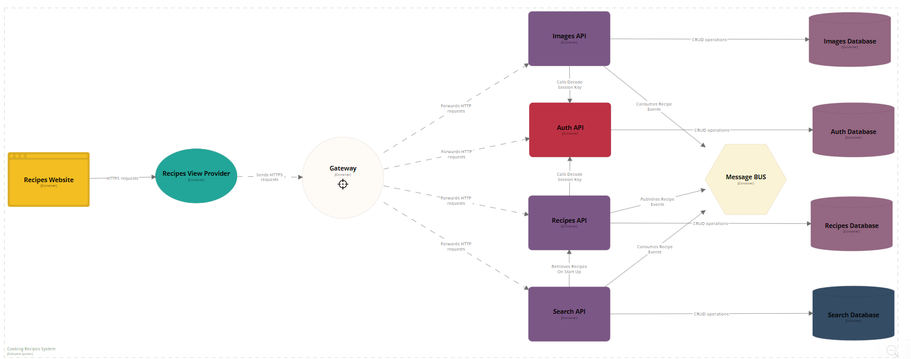

# sq-psk
- Vilnius University semester 6 PSK module.
- Group name: Slay Queen.
- Cooking Recipes System.
- Link to [Postman](https://www.postman.com/interstellar-eclipse-269289/workspace/sq-psk-api/collection/32090015-df2d5e2a-51df-4b1a-a5cd-8506c9137c63?action=share&creator=32090015).

## Running

All of these must be run in separate terminal sessions.

```
cd frontend && just run
cd Backend && docker compose up
cd Backend && dotnet run --project AuthService
cd Backend && dotnet run --project ImagesService
cd Backend && dotnet run --project RecipesSearchService
cd Backend && dotnet run --project RecipesService
```

## Technology Stack

- **ASP.NET C#** - for building service apis.
- **PostgreSql** - for recipes micro service.
- **Entity Framework** - for linking micro services to postgreSQL.
- **MongoDB** - for search recipes micro service.
- **MongoDB.Entities** - for linking micro services to mongoDB.
- **AutoMapper** - for mapping models, DTOs, contracts together.
- **RabbitMQ** - for micro service communication.
- **MassTransit** - message BUS client.
- **Microsoft YARP** - for gateway fucntionality.
- **BCrypt** - for password encription.
- **React.js** - for frontend.

## Architecture Diagram
In the diagram below each element is a program that runs independetly of other elements (and could be depolyed separetly):



## How To Setup?
...

## Notes
RabbitMq admin: http://localhost:15672/

TODO: fix notes

TODO: review & clean the code - DRY and move endpoint code into functions
MAYBE TODO: data consistency table (docker must start first)
MAYBE TODO: Image Service use auto mapper
MAYBE TODO: improve session logic/code
